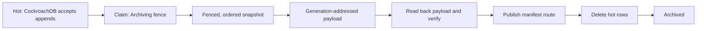

# Hot/cold archival and cutover

## Status

Pulpitum is an experimental `0.1.0` hot/cold table-routing foundation. It has a
fenced CockroachDB-to-object-store archival path and a recovery runner, but it
is not yet a production-ready distributed retention system. The full readiness
audit is in [`production-readiness.md`](production-readiness.md).

Despite the common shorthand, this is **not change-data-capture (CDC)
replication**. Pulpitum moves a complete, write-fenced, immutable historical
bucket to cold storage and switches the application's read route. It does not
continuously stream inserts, updates, and deletes from a writable source to a
writable target.

## Data model and authority

The Cassandra-style v4 physical record identity is:

```text
((table_id, partition_key, bucket_key), (event_time, sort_key))
```

A bucket is one `(table_id, partition_key, bucket_key)` physical partition, with records clustered by `(event_time ASC, sort_key ASC)`. `PartitionKey` and `SortKey` are opaque byte strings. `event_time` is the mandatory leading clustering component because it drives time-bucket routing and preserves chronological pagination across buckets. Its metadata stores `bucket_strategy` and its UTC `[bucket_start, bucket_end)` interval. Built-in strategies are `CalendarYearUtc` (default), `CalendarMonthUtc`, and `CalendarDayUtc`, with canonical opaque keys `year:YYYY`, `month:YYYY-MM`, and `day:YYYY-MM-DD`. Bucket keys are identifiers, not sortable timestamps; use the stored bounds for chronological work. The durable CockroachDB store is the authority for both mutable records and routing state. The object store is the authority for immutable payloads and manifests only.

| State | Writes | Reads | Hot rows |
|---|---|---|---|
| `Hot` | Accepted through `DurableTable` | CockroachDB | Present |
| `Archiving` | Rejected by the durable write fence | CockroachDB | Present |
| `Archived { hot_deleted: false }` | Rejected | Published archive manifest | Retained only for recovery/cleanup |
| `Archived { hot_deleted: true }` | Rejected | Published archive manifest | Deleted |

The retained hot copy after publication is **not** an automatic read fallback.
Once a route is `Archived`, `DurableTable` reads the archive. An object-store
failure is returned to the caller even when cleanup has not yet removed the hot
rows.

## Archival lifecycle



`DurableArchiveRecoveryRunner` and `pulpitum-archiver` implement the following
per-bucket protocol:

1. **Discover and claim.** The runner finds eligible hot buckets, expired
   pre-publication attempts, and published buckets whose cleanup is pending. A
   successful claim sets `Archiving`, creates an opaque owner token, increments
   a fencing generation, and sets an expiry.
2. **Fence writes and snapshot.** An append checks `Hot` and inserts its record
   in the same serializable CockroachDB transaction. Snapshot reads verify the
   token, generation, and expiry, so a stale worker cannot archive a bucket it
   no longer owns.
3. **Upload an immutable generation.** OpenDAL writes JSON or Zstandard Parquet
   to a generation-addressed object key. It writes a manifest v4 containing bucket
   identity, generation, format, record schema v2, payload key, row count,
   byte length, SHA-256 checksum, and clustering key `(event_time, sort_key)`.
4. **Verify before publishing.** The writer reads the payload back and verifies
   its checksum and decoded row count before returning the manifest key. The
   manifest is validated by readers; a separate manifest read-back/conditional
   creation boundary remains a follow-up item.
5. **Publish the route.** A conditional serializable transaction changes the
   bucket to `Archived { object_key: manifest_key, hot_deleted: false }`. This
   is the **read-cutover commit point**.
6. **Clean up safely.** A second conditional transaction deletes the hot rows
   and sets `hot_deleted = true`. If it fails, the published archive remains the
   read authority and another worker can claim cleanup after the lease/retry
   delay.

Pre-publication snapshot or upload failures call `defer_archive`, returning the
bucket to `Hot` with a durable retry time. Failures after upload cannot blindly
abort: publication may have committed despite an ambiguous client result. The
runner rereads durable state to decide whether to retry pre-publication work or
finish cleanup.

## When a bucket switches

There are two distinct moments:

1. **Eligibility:** the archiver may attempt a bucket.
2. **Cutover:** readers use cold storage after the conditional
   `publish_archive` transaction commits.

The standalone archiver uses a generic bucket-boundary cutoff, not row age or a per-record TTL:

| Setting | Default | Meaning |
|---|---:|---|
| `ARCHIVER_ELIGIBLE_BEFORE` | January 1 of the previous UTC year | RFC 3339 cutoff. A bucket is eligible when `bucket_end <= cutoff`. |
| `ARCHIVER_INTERVAL_SECONDS` | `15` | Discovery scan interval. |
| `ARCHIVER_LEASE_SECONDS` | `60` | Owner-lease duration for runner claims. |
| `ARCHIVER_RETRY_SECONDS` | `15` | Delay before retrying deferred work. |
| scan limit | `64` | Maximum work items discovered per cycle. |

For example, `ARCHIVER_ELIGIBLE_BEFORE=2025-01-01T00:00:00Z` makes any yearly, monthly, or daily bucket ending at or before that instant eligible. The actual cutover can occur later because the runner must discover, claim, upload, verify, and publish the bucket.

`ARCHIVER_KEEP_HOT_BUCKETS` and `ARCHIVER_ELIGIBLE_THROUGH_YEAR` are obsolete v2/year-specific settings and are not supported by the v4 archiver. `TableDefinition::writable_buckets` remains an application-ingestion guard counted in configured-strategy buckets; it is not the archiver's retention policy.

### Read visibility around publication

- A bucket in `Archiving` remains readable from CockroachDB but is no longer
  writable.
- An uncached CockroachDB read selects route metadata and its bounded hot rows in
  one statement/MVCC snapshot. A read racing publication therefore returns
  either the pre-publication hot page or the published archive route; it cannot
  combine a stale hot route with rows observed after cleanup.
- Hot and archiving observations are never cached and never select a later
  read's tier. State changes still invalidate local entries defensively.
- Published archive routes point to immutable generation manifests and use a
  bounded process-local cache, preserving the historical-read fast path without
  weakening cutover visibility.
- Each bucket read has its own statement snapshot. A query spanning buckets does
  not provide one cross-bucket snapshot.

## Schema and format changes

Pulpitum currently supports a fixed core record contract:

```text
partition_key: bytes, event_time: UTC timestamp, sort_key: bytes, value: bytes
```

For the built-in chat SQL surface, `channel_id` maps to `partition_key`, `timestamp` maps to `event_time`, and `id` maps to `sort_key`; the logical SQL column names and predicates do not change.

It is **not** a generic DDL or arbitrary-schema evolution layer. There is no
built-in support for `ALTER TABLE ADD COLUMN`, `DROP COLUMN`, or arbitrary type
changes across hot records and existing cold objects.

Archive *format* evolution is supported within the fixed record model:

- new buckets may be written as JSON or Parquet;
- each manifest records its format and `schema_version`;
- readers select the decoder from the manifest, so changing the configured
  write format does not invalidate earlier archives;
- record schema v2 uses the Parquet envelope `partition_key Binary`, `event_time Timestamp(ns, UTC)`, `sort_key Binary`, and `value Binary`; and
- legacy raw JSON payloads remain readable.

The current manifest reader accepts archive manifest version `4` and record schema version `2`. A record-schema
change must be an explicit compatibility migration:

1. add a versioned reader that accepts both the old and new record schemas;
2. extend the hot Cockroach schema, `Record`, archive writer, and SQL/Arrow
   adapter together;
3. specify null/default/cast semantics for historical archives;
4. write the new schema only after compatible readers are deployed; and
5. retire old readers only after the retention window proves they are no longer
   required.

The v4 CockroachDB control/data tables are `pulpitum_v4_bucket_metadata` and `pulpitum_v4_records`; `partition_key` and `sort_key` are `BYTES`. The v4 bootstrap creates these tables if absent and leaves existing v3 tables untouched: it does not read, upgrade, copy, or delete v3 rows, and there is no automatic data migration. An existing deployment must either start v4 under a new `TableId` and archive namespace/prefix, or perform an explicit, verified migration of metadata, records, and archive routing before directing v4 traffic at the migrated namespace. Numbered, reviewable migrations and upgrade tests remain future work.

## Comparison with PeerDB

PeerDB and Pulpitum solve adjacent but different problems.

| Dimension | Pulpitum | PeerDB |
|---|---|---|
| Primary purpose | Serve one logical hot/cold application table and reclaim hot storage | Replicate/ETL data from a source to downstream systems |
| Change model | One-time fenced snapshot of an immutable bucket | Continuous CDC/cursor/XMIN streaming, depending on mirror configuration |
| Source writes | Write-fenced for the bucket, then source rows are deleted after publication | Source remains writable; the destination is maintained as a mirror |
| Read path | `DurableTable` selects CockroachDB or an archive manifest | Consumers query or consume the destination; PeerDB does not cut over an application's reads |
| Schema changes | Fixed record schema; explicit compatibility migration required | Detects source changes and propagates a supported subset to supported destinations |
| Typical target | Immutable JSON/Parquet in an S3-compatible store | Warehouses, queues, databases, and storage connectors |

PeerDB's documented Postgres schema support includes automatic propagation of
added columns after a subsequent data change. Added columns with defaults do
not backfill the default into existing destination rows without a full refresh;
dropped columns are detected but not propagated, and later rows carry `NULL` in
the destination column. See the [PeerDB schema-change documentation](https://docs.peerdb.io/features/schema-changes.md).

Use Pulpitum when an application needs one low-latency logical table over
recent CockroachDB records and immutable history. Use PeerDB when the goal is a
continuously updated analytical or operational replica. They may be used
together, but Pulpitum does not currently ingest PeerDB-produced files or
mirror metadata.

## Current limits

The implementation has durable fencing and recovery behavior, but these
limitations prevent a production distributed-storage claim:

- Bucket strategy is immutable for a `TableId`; changing it requires a new `TableId` and an explicit data migration.
- Existing bucket metadata doubles as the recovery job record; there is no separate operational job model.
- The store exposes lease renewal, but the runner does not yet renew while a
  long snapshot or upload is in progress. Work must currently finish within
  its lease or lose ownership safely.
- The archive payload is read back and verified, but manifest conditional
  creation/read-back verification and orphan-object cleanup are still missing.
- There are no durable read leases, so a routed read can race a cross-process
  cutover/cleanup within the documented route-cache bound.
- Snapshots and archive reads materialize complete buckets in memory; range and
  size limits are not yet sufficient for unbounded history.
- Recovery tests model takeover and use real adapters, but independent
  coordinator-container kill/restart and partition tests are incomplete.

## Next steps

The following order protects correctness before adding scale or new features:

1. **Harden v4 migrations.** Replace bootstrap DDL with numbered v4 migrations, document the explicit v3-to-v4 backfill and rollback boundaries, and retain overlapping-table tests.
2. **Finish lease and failure handling.** Renew claims throughout snapshot,
   upload, publication, and cleanup; add operation deadlines, cancellation-safe
   transactions, and independent-process takeover/partition tests.
3. **Make retention a control-plane contract.** Persist table registration,
   retention policy, grace period, archive profile, pause state, and archival
   jobs. Derive ingestion and eligibility rules from the same policy.
4. **Harden archive publication.** Use conditional or content-addressed object
   creation, verify the manifest itself before publication, and garbage-collect
   unreferenced payloads after a safety delay.
5. **Specify record-schema evolution.** Define compatibility beyond record schema v2,
   historical defaults/null semantics, schema migration tests, and an operator
   runbook before extending the record shape.
6. **Bound and stream reads.** Push cursor/range/projection predicates into
   CockroachDB and Parquet, stream ordered batches, and enforce byte, row,
   range, and execution-time limits.

The target coordinator architecture, including a dedicated table registry and
job state machine, is described in
[`archival-coordinator.md`](archival-coordinator.md). The audited acceptance
criteria and test gaps are in [`production-readiness.md`](production-readiness.md)
and [`testing.md`](testing.md).
