# Pulpitum

**Append-oriented, partition-local hot/cold table routing for CockroachDB and S3-compatible storage.**

Pulpitum keeps recent records in CockroachDB and can serve immutable historical buckets from object storage without making callers choose a tier. Its core concern is the cutover protocol: fence writes, verify an immutable archive, publish a durable route, and only then clean up hot rows.

> **Status: experimental.** The supported safe default is a v4 hot-store deployment. Deployment-owned archival is disabled unless explicitly enabled after environment-specific fault acceptance.

## Start here

- [Getting started](getting-started.md) — local setup, schema migration, and a safe runtime profile.
- [Capability and safety posture](capabilities.md) — supported features, intentionally blocked capabilities, and production boundaries.
- [Architecture](storage-backend-decoupling.md) — layers and storage contracts.
- [Testing and fault inventory](testing.md) — routine and Docker-backed validation.

## Core model

```text
((table_id, partition_key, bucket_key), (event_time, sort_key))
```

- `table_id` isolates logical tables.
- `partition_key` routes a logical partition.
- `bucket_key` is derived from a UTC calendar strategy.
- `(event_time, sort_key)` is the chronological clustering and pagination key.

The built-in chat mapping is:

| Logical column | Core field |
|---|---|
| `channel_id` | `partition_key` |
| `timestamp` | `event_time` |
| `id` | `sort_key` |
| `value` | record payload |

## How the pieces fit together



The [editable Mermaid source](assets/architecture.mmd) is kept alongside the SVG. The hot path stays in CockroachDB. The archival worker is disabled by default because it eventually deletes the hot copy; when explicitly enabled, it claims a durable lease, verifies immutable objects, publishes the archive route, and only then performs cleanup.

## Supported deployment profile

Pulpitum currently supports a deliberately narrow operational profile:

- versioned v4 CockroachDB schema migrations;
- secure CockroachDB connections using rustls and optional mTLS;
- secure PgWire sidecar mode using TLS and SCRAM authentication;
- bounded, partition-local SQL reads and single-row inserts;
- append-oriented hot data in CockroachDB;
- immutable, checksummed archive artifacts when archival has been explicitly enabled.

See [Capabilities](capabilities.md) before enabling archival or exposing the SQL sidecar.

## Engineering references

- [Hot/cold archival lifecycle](hot-cold-archival.md)
- [Archival coordinator](archival-coordinator.md)
- [PostgreSQL/DataFusion contract](datafusion.md)
- [Observability assets](https://github.com/pulpitum-tech/pulpitum/tree/main/observability)
- [Production-readiness audit](production-readiness.md)
- [Staging sidecar benchmark](staging-sidecar-benchmark.md)

## Project links

- [Source code](https://github.com/pulpitum-tech/pulpitum)
- [Report a security vulnerability](https://github.com/pulpitum-tech/pulpitum/security/advisories/new)
- [Apache-2.0 license](https://github.com/pulpitum-tech/pulpitum/blob/main/LICENSE)
