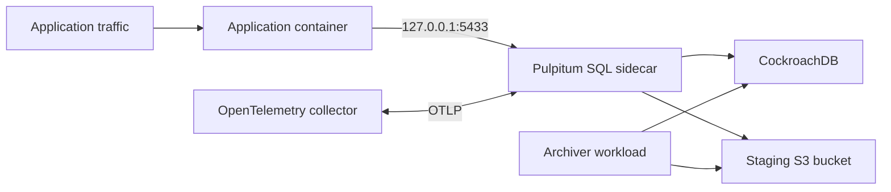

# SQL sidecar staging benchmark and delivery specification

## Status and purpose

This document defines the staging-only evaluation of `pulpitum-sql-sidecar`, the container delivery path required to run it, and the evidence needed to decide whether the hot/cold routing model is worth adopting. It is not a production deployment specification.

The sidecar currently has no SQL authentication or TLS, CockroachDB transport is development-only `NoTls`, archive reads can materialize complete payloads, and independent multi-worker archival recovery evidence is incomplete. Those are release blockers documented in [production-readiness.md](production-readiness.md). A staging result does not change that assessment.

## Goals

- Measure the maximum sustainable request rate and latency of the sidecar for its supported PostgreSQL query shapes.
- Compare direct CockroachDB access with hot-tier and archived-tier sidecar reads using the same data, operation mix, and resources.
- Verify that deployment packaging, migration, sidecar startup, and basic SQL routing work before EKS is involved.
- Establish an ECR image supply path that uses GitHub Actions OIDC rather than static AWS credentials.
- Produce reproducible benchmark artifacts: configuration, image digest, dataset description, result JSON, dashboard links, and correctness results.

## Non-goals

- Exposing the unauthenticated sidecar through an ingress, `Service`, or cross-Pod network endpoint.
- Declaring Pulpitum production-ready or comparing it to CDC/ETL and lakehouse systems such as PeerDB, Iceberg, Hudi, or Delta Lake. Those products solve different problems.
- Tuning CockroachDB, S3, or Kubernetes resources until the benchmark reaches a desired answer.
- Benchmarking arbitrary PostgreSQL. The sidecar supports only its documented single-table inserts and bounded reads.

## Deployment boundary



The sidecar and its consuming application must share a Pod and the sidecar must retain its default `127.0.0.1:5433` listener. A load client that exercises raw PostgreSQL may share the benchmark Pod network namespace, but external Pods must not connect to the unauthenticated listener.

The staging namespace uses a dedicated Cockroach database/schema, `TableId`, S3 prefix, and disposable dataset. A short-lived migration Job runs as the migration role. The app, sidecar, and archiver use the restricted runtime role. Current S3 configuration uses static access-key environment variables; until workload-identity support exists, inject short-lived least-privilege staging credentials through the platform secret mechanism and never commit them.

## Image and local smoke test

`docker/sidecar.Dockerfile` is the canonical image build. It contains only the SQL sidecar and the short-lived migration utility, runs as UID/GID `10001`, and defaults to the sidecar executable. A migration Job may override its command with `/usr/local/bin/pulpitum-migrate`.

Run the local image smoke test from the repository root:

```sh
./docker/scripts/run-sidecar-smoke.sh
```

The disposable Compose stack starts a single insecure CockroachDB node and MinIO, creates the S3 bucket, runs the migration utility, starts the image, and uses `psql` to insert and then perform a bounded read. The script tears down containers and volumes on exit. It is not the full showcase or a performance test.

A successful smoke test proves all of the following:

1. the image builds for the host platform;
2. the non-root image can run both migration and sidecar executables;
3. the migration creates the runtime role and grants its intended DML permissions;
4. the runtime role can append through the PostgreSQL-wire sidecar; and
5. the sidecar can return the bounded row read it just accepted.

For an x86_64 EKS cluster built from Apple Silicon, publish `linux/amd64`; for mixed clusters, publish both `linux/amd64` and `linux/arm64`. Deployment images must be pinned by digest, not `latest`.

## Comparison matrix

Every experiment uses the same cluster topology, pod CPU/memory requests and limits, sidecar pool size, dataset, query mix, object-store region, duration, and image digest except for the variable under test.

| ID | Variant | Question answered |
|---|---|---|
| B0 | Direct CockroachDB path | Baseline without the gateway, routing, or archive layer. |
| B1 | Sidecar with current hot data | Gateway and durable-route overhead while all data stays in CockroachDB. |
| B2 | Sidecar with archived data and cache disabled | Cold archive-read latency, S3 traffic, and decode cost. |
| B3 | Sidecar with archived data and warmed immutable cache | Steady-state archive-read latency and cache benefit. |
| B4 | Sidecar archives encoded as Parquet | Encoding/storage trade-off relative to JSON under identical archived data. |
| B5 | CockroachDB-only retention | Operational and cost alternative of retaining the complete dataset in the hot database. |

B0 must implement the same logical insert and bounded `(channel_id, timestamp range, order, limit)` read semantics. A query that is not accepted by the sidecar is not part of this comparison.

## Workload design

The current showcase workload in `examples/showcase.rs` is a source of truth for supported SQL shapes and a useful first signal, but it is an endless demo. Before collecting decision-grade results, extract or replace it with a finite `pulpitum-loadtest` Kubernetes Job that accepts:

- `duration`, `warmup_duration`, offered RPS, concurrency, random seed, and burst profile;
- percentage mix of append, recent hot read, historical archive read, and cross-tier count;
- channel count, record-value size distribution, history range, archive format, and cache limits; and
- an output path for a machine-readable JSON summary.

Use an open-loop offered-rate model. Record queue drops explicitly rather than letting backlog grow without bounds. Test each fixed offered rate three times after a five-minute warm-up; use a 15-minute measurement window. Start at 25 RPS and double through 50, 100, and 200 RPS only while the prior rate remains within the agreed error and latency thresholds.

Each result must include client p50/p95/p99/max latency by operation, offered/completed RPS, successes, failures, timeouts, reconnects, and dropped work. Seed meaningful archived bucket sizes: the showcase's eight records per channel are suitable for smoke coverage but not archive-read capacity conclusions.

## Measurements and pass conditions

The benchmark report must retain the following for every run:

| Area | Required measurement |
|---|---|
| Client | Offered/completed RPS; p50/p95/p99/max by operation; errors, timeouts, reconnects, queue drops. |
| Sidecar | CPU, memory, restarts, gateway span latency, SQL connection pool utilization, waiters, acquire p95/p99, and connection churn. |
| CockroachDB | CPU, memory, statement latency, active connections, contention/retry signals, and storage growth. |
| S3 | Request count, GET/PUT bytes, error rate, request latency, and archive-cache hit/miss/eviction metrics once implemented. |
| Archival | Cutover duration, coordinator phases, failed/retried jobs, and hot/archive route counts. |
| Correctness | Expected count per channel, ordered result equivalence, no lost writes, and final durable bucket state. |

The default stop conditions are: error or timeout rate above 1%, any queue drops during the measured window, or p99 exceeding the agreed scenario SLO. The owning team must select concrete SLO values before the first measurement. Report the first failing rate, not just the highest attempted rate.

Required observability already exists for gateway spans, route tiers, archival lifecycle, and SQL-pool pressure; see [../observability/README.md](../observability/README.md). Add explicit immutable-cache and load-generator metrics before treating B2/B3 as a decision metric.

## Staging rollout sequence

1. Provision a `pulpitum-benchmark` namespace with resource quotas and NetworkPolicies.
2. Provision a dedicated S3 bucket or prefix with lifecycle deletion and a least-privilege staging-only identity.
3. Build an image, scan it, record the digest, and deploy only that digest.
4. Run a migration Job to create the schema and runtime role.
5. Deploy the app plus loopback sidecar, the archiver, and OpenTelemetry collector.
6. Seed and verify the known dataset; archive the prescribed historical buckets.
7. Run B0 through B5 with the fixed run protocol and retain result artifacts.
8. Run archival fault exercises separately: process restart, Cockroach gateway loss, and S3 outage. These are safety evidence, not throughput comparisons.
9. Publish a decision record comparing latency, sustainable rate, operational risk, storage cost, and unresolved production blockers.

The existing `docker/scripts/run-e2e.sh` and Toxiproxy scripts remain the local fault-test baseline. Staging tests must not delete or archive shared application data.

## GitHub Actions and ECR delivery

The repository contains two workflows:

- `.github/workflows/ci.yml` runs formatting, strict Clippy, all-feature tests, and the canonical image build on pull requests and `main`.
- `.github/workflows/publish-staging-image.yml` is manually dispatched, targets the protected `staging` environment, and publishes one commit-SHA-tagged image with SBOM and provenance attestations.

Before enabling publishing, configure the GitHub repository or organization variables:

| Variable | Meaning |
|---|---|
| `AWS_REGION` | ECR region, such as `us-east-1`. |
| `AWS_ROLE_TO_ASSUME` | IAM role ARN trusted through GitHub OIDC. |
| `ECR_REPOSITORY` | ECR repository name, such as `pulpitum/sql-sidecar`. |

Create the ECR repository with immutable tags, scan-on-push, and a lifecycle policy for old untagged artifacts. The AWS trust policy must restrict assumption to this repository and the protected staging environment; the role may only obtain an ECR authorization token and push/pull the configured repository. Do not configure AWS access keys as GitHub secrets.

The workflow summary prints the deployment-ready image digest. Copy that digest into the staging Helm/Kustomize change or GitOps promotion commit. Image publication must not itself deploy to EKS.

## Repository ownership

An ECR registry does not require a dedicated GitHub organization. Prefer a private `pulpitum` repository under the existing company GitHub organization if one exists, so SSO, billing, branch protection, and AWS OIDC ownership are already established. Create a separate `pulpitum` organization only when the project needs independently owned branding, maintainers, and public release policy. In either case, protect `main`, require CI, configure a review-gated `staging` environment, and add `CODEOWNERS` before enabling image publication.

## Exit criteria

This evaluation is complete only when the local smoke test and CI image build pass, the staging digest is reproducible through OIDC, the B0-B5 result table is complete, correctness checks pass, and a written decision identifies whether Pulpitum's cross-tier behavior justifies its added latency and operational complexity. Production promotion remains blocked by the acceptance criteria in [production-readiness.md](production-readiness.md).
