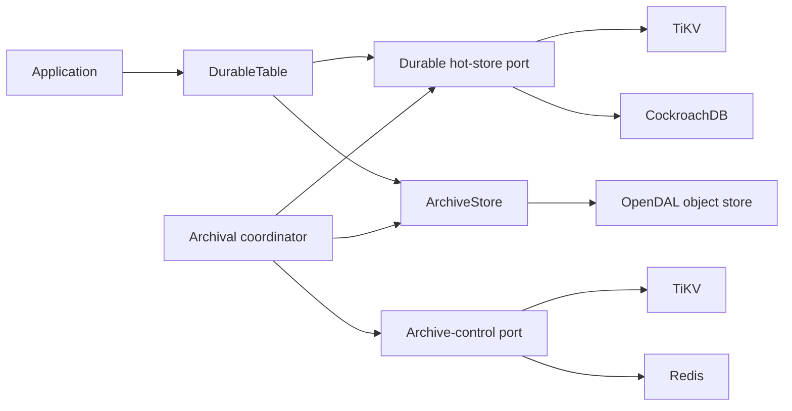

# Decoupling CockroachDB from Pulpitum storage

## Status

**Proposal.** This document defines a path to make CockroachDB an optional Pulpitum adapter rather than a hard dependency, while preserving the current durable archival safety model.

The target architecture supports:

- **TiKV** as the reference transactional hot-store and durable control-plane backend;
- **CockroachDB** as an optional compatible backend;
- **Redis** first as a non-authoritative work-dispatch/lease acceleration layer, and later—subject to explicit durability and atomicity requirements—as a control-plane backend; and
- **OpenDAL** for immutable cold/archive payloads and manifests.

It does **not** treat OpenDAL as a replacement for the mutable hot store or the authoritative archive control plane.

## Problem

The default crate currently has a direct dependency on `tokio-postgres`, and its safe data path is implemented by `CockroachDurableBucketStore`. The adapter owns both mutable records and bucket-routing metadata in CockroachDB serializable transactions.

That coupling is intentional for the current correctness model:

- an append verifies `Hot` state and writes the record in one transaction;
- archive ownership transitions from `Hot` to `Archiving` with a monotonic fencing generation;
- a snapshot, archive publication, and cleanup are conditional on the active owner token and generation; and
- read routing and mutable records are read together.

Removing CockroachDB must preserve these semantics. Replacing SQL calls with a generic key/value API without stating the required transactional behavior would weaken archival safety.

## Goals

1. The default `pulpitum` feature set contains no CockroachDB or PostgreSQL client dependency.
2. Durable routing and archive-cutover semantics are specified in backend-neutral terms.
3. TiKV is a production-reference implementation for the coupled hot-store and control-plane state.
4. CockroachDB remains usable through an opt-in adapter feature during and after the migration.
5. Redis can be used safely for optional scheduling acceleration and, only after its requirements are met, durable control-plane state.
6. OpenDAL continues to abstract immutable archive storage independently from the selected hot/control backend.
7. Correctness tests run against every backend claiming a given capability.

## Non-goals

- Supporting arbitrary OpenDAL services as a transactional hot store.
- Promising that every Redis deployment is a safe durable control plane.
- Providing cross-backend atomic archival transitions between independently authoritative hot and control stores.
- Changing the existing v4 bucket strategy for a `TableId` as part of this work.
- Solving archive format, streaming query, or DataFusion pushdown independently of their already planned work. The archive interface changes below must remain compatible with those efforts.

## Architectural decision

### Storage responsibilities



| Responsibility | Authority | Initial backends |
|---|---|---|
| Recent records, bucket routing, write fences, archive cutover | Durable hot store | TiKV, CockroachDB |
| Table registration, archival jobs, retries, operator actions | Archive control store | TiKV, CockroachDB; Redis later under constraints |
| Immutable archive payloads and manifests | Archive store | OpenDAL-backed object stores |
| Work wakeups / queue acceleration | Non-authoritative optimization | Redis |

### Colocation rule

The write fence and the hot records it protects **must be atomically updated by the same authoritative backend transaction**. In particular, a Redis control-plane lease cannot by itself authorize or reject a TiKV/Cockroach record append.

Archive jobs and bucket routing are separate concerns:

- bucket metadata is the read-routing authority (`Hot`, `Archiving`, `Archived`);
- archival jobs are the operational authority for discovery, retries, worker ownership, and recovery; and
- every publication and cleanup action must be conditionally authorized by a fence held in the durable hot store.

This permits an archive job store to be separate from the hot store, but it does not permit the job store to replace the hot-store fence.

## Why OpenDAL is archive-only

OpenDAL is the appropriate abstraction for the cold data plane: writing and reading immutable archive payloads and manifests across S3-compatible object stores, cloud object stores, or local development storage.

It does not standardize the operations required by the hot/control plane:

- serializable or optimistic transactions;
- atomic compare-and-set state transitions;
- ordered range scans over mutable records;
- consistent bucket snapshots;
- atomic state transition plus record deletion; or
- lease/fencing semantics.

The archive port should therefore evolve toward immutable payload creation and manifest verification, while database/KV-specific adapters implement the durable state machine.

## Required backend-neutral contracts

The current sealed `DurableBucketStore` mixes hot records, routing, and the in-memory `ArchiveSession` credential. Replace it with semantic ports that make the required guarantees testable without exposing generic backend operations.

### 1. Durable hot-store port

This is the authoritative data-plane boundary. Its implementation must atomically coordinate bucket routing/fences with mutable records.

Conceptual operations:

```rust
trait DurableHotStore: Send + Sync {
    async fn append_if_writable(&self, record: Record) -> Result<(), HotStoreError>;
    async fn read_range(
        &self,
        bucket: &BucketId,
        range: &TimeRange,
    ) -> Result<RoutedBucketRead, HotStoreError>;

    async fn claim_archive_fence(
        &self,
        bucket: &BucketId,
        claim: ArchiveClaim,
    ) -> Result<ArchiveFence, HotStoreError>;
    async fn renew_archive_fence(&self, fence: &ArchiveFence) -> Result<(), HotStoreError>;
    async fn snapshot_fenced(
        &self,
        fence: &ArchiveFence,
    ) -> Result<BucketSnapshot, HotStoreError>;
    async fn publish_manifest(
        &self,
        fence: &ArchiveFence,
        manifest: PublishedArchive,
    ) -> Result<(), HotStoreError>;
    async fn cleanup_fenced(
        &self, fence: &ArchiveFence
    ) -> Result<CleanupResult, HotStoreError>;
}
```

The real API may combine selected operations, but every implementation must provide these semantic guarantees:

- successful append checks the bucket is writable in the same transaction as the mutation;
- fence claims and renewals have a monotonically increasing generation and an opaque owner token;
- stale or expired owners cannot snapshot, publish, or delete;
- published archive routing remains readable while cleanup is pending; and
- cleanup is retry-safe and idempotent after a crash or unknown prior result.

`ArchiveFence` replaces an adapter-shaped `ArchiveSession`. It remains opaque to callers and includes the physical bucket identity and externally observable generation, while the token stays private.

### 2. Archive-control port

The control plane persists table registration and job lifecycle. It must offer conditional state transitions rather than expose generic key/value methods.

Conceptual operations:

```rust
trait ArchiveControlStore: Send + Sync {
    async fn register_table(&self, table: RegisteredTable) -> Result<(), ControlStoreError>;
    async fn list_eligible_buckets(&self, now: DateTime<Utc>) -> Result<Vec<BucketId>, ControlStoreError>;
    async fn upsert_job(&self, bucket: &BucketId) -> Result<ArchiveJob, ControlStoreError>;
    async fn claim_job(&self, request: JobClaimRequest) -> Result<JobLease, ControlStoreError>;
    async fn renew_job(&self, lease: &JobLease) -> Result<(), ControlStoreError>;
    async fn transition_if_owned(&self, transition: JobTransition) -> Result<ArchiveJob, ControlStoreError>;
    async fn list_recoverable_jobs(&self, now: DateTime<Utc>) -> Result<Vec<ArchiveJob>, ControlStoreError>;
}
```

Required job data is described in [`archival-coordinator.md`](archival-coordinator.md): stable table and bucket identity, phase, generation, lease token/expiry, retry metadata, payload/manifest integrity data, diagnostics, and audit timestamps.

### 3. Archive-store port

Retain an OpenDAL-backed archive adapter, but replace raw JSON/object-key publication with verified immutable artifacts:

```rust
trait ArchiveStore: Send + Sync {
    async fn write_immutable_payload(
        &self,
        identity: &ArchivePayloadIdentity,
        snapshot: BucketSnapshot,
    ) -> Result<ArchiveManifest, ArchiveStoreError>;
    async fn verify_manifest(&self, manifest: &ArchiveManifest) -> Result<(), ArchiveStoreError>;
    async fn read_manifest(&self, key: &str) -> Result<ArchiveManifest, ArchiveStoreError>;
    async fn read_records(&self, manifest: &ArchiveManifest, range: &TimeRange)
        -> Result<Vec<Record>, ArchiveStoreError>;
}
```

The implementation must write a generation- or content-addressed payload and a versioned manifest containing table ID, bucket identity, generation, schema/format version, checksum, record count, payload length, and payload key.

## Physical identity and keys

Every backend key must contain the v4 stable physical table ID. A logical table name is not a safe storage namespace. The compact Cassandra-style identity is:

```text
((table_id, partition_key, bucket_key), (event_time, sort_key))
```

The physical partition key is `(table_id, partition_key, bucket_key)`, and records cluster by `(event_time ASC, sort_key ASC)`. `PartitionKey` and `SortKey` are opaque byte strings. `event_time` must remain the leading clustering component because bucket routing and cross-bucket pagination are chronological.

Bucket metadata must also retain `bucket_strategy` and UTC `[bucket_start, bucket_end)` bounds. Bucket keys are opaque; chronological routing must use the descriptor bounds rather than lexical key order.

Suggested logical TiKV key prefixes:

```text
pulpitum/v4/table/{table_id}/bucket/{encoded_partition_key}/{encoded_bucket_key}/metadata
pulpitum/v4/table/{table_id}/bucket/{encoded_partition_key}/{encoded_bucket_key}/record/{event_time}/{encoded_sort_key}
pulpitum/v4/table/{table_id}/archive-job/{encoded_partition_key}/{encoded_bucket_key}
```

The precise binary encoding must preserve the required record order by `(event_time, sort_key)` and must not concatenate unescaped user-controlled components. It should be shared by TiKV, Redis, test doubles, archive paths, and manifest serialization where applicable.

## TiKV reference implementation

TiKV is the first alternative durable backend because it provides transactional key/value semantics, ordered key-range scans, conditional updates, and a Rust-native client ecosystem.

### Data layout

- Keep bucket metadata and records under a common table/bucket prefix so one transaction can read and update them.
- Store the bucket metadata as a single encoded value containing routing state, generation, active fence, expiry, manifest reference, and `hot_deleted` state.
- Store each record under a lexicographically sortable key beneath the same prefix.
- Store archival jobs and table registry records under separate, namespaced prefixes.
- Define size limits for a transactionally read snapshot. Large buckets must transition to a bounded/chunked snapshot design rather than growing one transaction indefinitely.

### Transactional behavior

Implement the existing state-machine semantics with TiKV transactions:

1. `append_if_writable` reads/creates metadata, verifies `Hot`, and writes the record in one transaction.
2. `claim_archive_fence` atomically changes `Hot` to `Archiving`, increments generation, and records a token plus expiry. Expired claims can be taken over by a new generation.
3. `snapshot_fenced` verifies token, generation, and expiry before range-scanning records in the bucket.
4. `publish_manifest` verifies the active fence and atomically changes routing to `Archived { manifest_key, hot_deleted: false }`.
5. `cleanup_fenced` verifies the active fence, deletes hot records, sets `hot_deleted`, and advances the job/completion state idempotently.

Use bounded retries for retryable transaction conflicts. Treat transport errors and commit errors as potentially ambiguous: recover by rereading durable state rather than blindly reissuing externally visible work.

### Time and leases

Lease behavior needs an injected clock and a documented time source. Do not rely solely on independent application-host clocks. Tests must cover clock advancement, renewal, expiration, and stale-worker takeover deterministically.

### Package and feature boundary

Add a dedicated `pulpitum-tikv` adapter crate or feature-gated adapter module. The selected organization should ensure the core crate does not expose TiKV client types in its public API.

## CockroachDB compatibility implementation

CockroachDB remains a supported implementation during the transition, but moves behind an explicit Cargo feature or adapter crate.

1. Gate `tokio-postgres`, `CockroachPool`, `CockroachDurableBucketStore`, legacy Cockroach adapters, and Cockroach integration tests behind `cockroach`.
2. Keep the public backend-neutral port types free of PostgreSQL/Cockroach-specific concepts.
3. Translate the present coupled metadata/records schema into versioned migrations owned by the Cockroach adapter.
4. Complete existing operational work independently: TLS configuration, cancellation-safe transaction cleanup, deadlines, and recovery integration coverage.
5. Do not remove Cockroach support until TiKV passes the same required capability and recovery matrix.

The legacy `CockroachHotStore` / `CockroachMetadataStore` split path should remain explicitly legacy and must not become the model for new adapters.

## Redis scope and safety requirements

### Phase 1: non-authoritative acceleration

Redis may be used early for notifications, delayed-work wakeups, or a work queue that reduces coordinator scan latency. It is not the source of truth:

- durable bucket routing and write fences remain in TiKV or CockroachDB;
- archive jobs remain recoverable from the durable control store;
- losing Redis causes delayed work discovery, not lost work or unsafe archival; and
- the coordinator periodically rescans the authoritative store to repair missed events.

### Phase 2: optional durable control-store adapter

A `RedisArchiveControlStore` can be considered only when it implements and is tested against the same job-store contract. Its supported deployment profile must require:

- AOF persistence with a documented fsync policy;
- replication, failover, backup, and restore procedures aligned to the control-plane RPO/RTO;
- Lua scripts or Redis Functions for all conditional claim/renew/transition operations;
- opaque lease tokens and monotonically increasing fencing generations;
- hash-tagged keys so all keys required by a script are colocated in a Redis Cluster slot;
- retry and ambiguous-result recovery that rereads job state before reissuing a transition; and
- an expiry/reaper design that never deletes the sole durable evidence of an incomplete job.

Even with these conditions, Redis job ownership does not authorize a cross-store hot-data mutation. The coordinator must acquire/verify the durable hot-store fence before snapshot, manifest publication, or cleanup.

### Redis hot-store status

Redis is **not an initial `DurableHotStore` target**. Supporting it would need an explicit design and evidence for:

- ordered range reads and pagination for `(event_time, sort_key)`;
- consistent fenced snapshots over large buckets;
- atomic routing/fence updates with all relevant record mutations;
- bounded deletion of large buckets without violating retry-safe cleanup; and
- durability/failover behavior appropriate for recent source-of-truth data.

Do not present a Redis adapter as a transparent substitute for TiKV/CockroachDB until these criteria are implemented and validated.

## Cargo and crate structure

Target dependency graph:

```text
pulpitum-core
  - domain types, application workflows, backend-neutral ports
  - OpenDAL archive contract and optional archive adapter

pulpitum-tikv
  - TiKV durable hot store and control store

pulpitum-cockroach
  - CockroachDB durable hot store/control store and migrations

pulpitum-redis
  - Redis work-dispatch helper; later optional ArchiveControlStore

pulpitum
  - compatibility facade and feature selection
```

A workspace split is preferred if adapter dependencies materially increase compile time or use incompatible transitive dependencies. A feature-gated single crate is acceptable as a first mechanical step if it preserves the same public boundaries.

Proposed features:

```toml
[features]
default = ["opendal"]
opendal = []
tikv = ["dep:tikv-client"]
cockroach = ["dep:tokio-postgres"]
redis = ["dep:redis"]
```

Exact dependency names and version constraints should be selected only after an API spike confirms the required TiKV and Redis capabilities. The core crate must compile and run in-memory unit tests with no `cockroach`, `tikv`, or `redis` feature enabled.

## Migration and rollout

Pulpitum can support two migration modes. The preferred mode for a bucketed workload is **drain and retire**: assign newly opened buckets to the new backend, retain the old backend only for the buckets it already owns, archive those buckets normally, then remove the old backend. This avoids copying or dual-writing active records.

A backfill/cutover migration remains necessary when a table must move before its currently active buckets naturally close.

### Compatibility principles

- Preserve the v4 `TableId` and bucket-descriptor identity in every backend.
- Do not reinterpret v3 Cockroach rows as v4. The implemented Cockroach bootstrap creates new v4 tables and leaves v3 tables untouched; use a new `TableId` plus archive namespace/prefix or explicitly backfill and verify v4 metadata, records, and archive routing.
- Make each backend adapter own numbered, reviewable schema/keyspace migrations and compatibility checks.
- Keep archive manifests backend-independent so archives can be read after a hot-store migration.
- Never dual-write or dual-delete active records without a documented source of truth, reconciliation procedure, and cutover/rollback plan.
- A bucket has exactly one immutable **home hot-store** from creation until it is archived. It must never be moved while accepting writes.
- The durable control-plane/catalog store must outlive every backend it is coordinating. It cannot be hosted only on a store scheduled for retirement.

### Bucket placement catalog

Add a durable, backend-independent placement catalog, normally owned by the target durable control store (for example TiKV). It maps physical bucket identity to its current home and terminal archive location:

| Field | Purpose |
|---|---|
| `table_id`, `partition_key`, `bucket` | Immutable physical bucket identity |
| `home_store_id` | Configured hot-store backend that owns an unarchived bucket |
| `placement_epoch` | Monotonic configuration/rollout epoch for audit and stale-config detection |
| `state` | `Hot`, `Archiving`, or terminal `Archived` |
| `archive_manifest_key`, digest, generation | Verified terminal archive route |
| timestamps | Audit, drain progress, and stale-placement monitoring |

A `StoreId` identifies a provisioned adapter instance, not an endpoint or embedded connection string. Backend credentials and connection configuration stay outside catalog records.

For `Hot` or `Archiving`, `DurableTable` uses `home_store_id` to select the adapter. That adapter remains the authority for its local write fence and routing state. Once the bucket is durably archived, the catalog records the immutable manifest location so clients no longer need the retired backend to resolve reads.

The catalog must be populated before a bucket receives its first write. Placement creation is idempotent and immutable: a conflicting store assignment for an existing bucket is an error. Pre-provisioning the next bucket before its time boundary avoids requiring a distributed transaction between catalog creation and the first hot-record append.

### Preferred path: drain one hot store into archives

This implements the proposed behavior: start the next bucket on the new store, wait for buckets on the old store to archive, and then remove the old store.

1. **Establish a surviving control plane**: deploy a placement catalog compatible with v4 bucket descriptors, archive-job store, immutable manifest support, and coordinator on TiKV or another backend that will remain after CockroachDB retirement. Do not turn down CockroachDB yet.
2. **Inventory existing buckets**: register every existing Cockroach-owned bucket in the catalog with `home_store_id = cockroach-primary`. Record existing archive routes and incomplete archive state.
3. **Add and validate the new adapter**: deploy TiKV, pass its conformance suite, and register `tikv-primary` as a writable store. Applications must be capable of reading both placements before any new writes are directed to TiKV.
4. **Schedule a placement epoch**: configure a future bucket boundary at which newly created buckets use `tikv-primary`. Existing bucket placements remain immutable and continue to route to CockroachDB.
5. **Pre-create each next bucket placement**: before the configured boundary, write the new immutable catalog entry pointing to TiKV. At the boundary, the first append is routed to TiKV and is fenced only by TiKV metadata/records.
6. **Drain old placements**: the coordinator discovers Cockroach-owned buckets only after they are no longer writable under the table retention policy. It obtains the Cockroach fence, snapshots, writes and verifies an immutable OpenDAL archive, publishes through the Cockroach adapter, records the same verified manifest in the surviving catalog, and runs fenced cleanup on CockroachDB.
7. **Reconcile cross-store progress**: catalog publication is idempotent by `(table_id, bucket, generation, manifest digest)`. If a process dies between Cockroach publication and catalog update, a recovery worker reads the old backend's published route, verifies the manifest, and completes the catalog entry. Do not remove CockroachDB until reconciliation reports no non-terminal Cockroach placements.
8. **Retire the old store**: require every Cockroach placement to be terminal `Archived`, with a verified catalog manifest and no active/recoverable job. Run sampled archive reads and a complete catalog audit, retain backups for the agreed recovery window, then remove the Cockroach adapter configuration and infrastructure.

This route requires no active-record copy and no cross-store write transaction because a bucket never changes home while it is hot. The only cross-store handoff is the idempotent publication of an already verified immutable archive manifest; reconciliation makes its uncertain outcome safe.

### Current bucket-layout limitation

The v4 physical partition is `(table_id, partition_key, bucket_key)` with a configured UTC calendar strategy and persisted bounds. Therefore "start the next bucket on TiKV" means waiting for the next boundary of that strategy for each partition key: year, month, or day. An existing bucket remains writable until its configured strategy interval closes and the application write window no longer accepts it.

A yearly strategy can make backend retirement take years; monthly or daily strategies reduce that wait. The strategy is immutable for a `TableId`: do not reinterpret an existing bucket key. Create a new `TableId`, backfill/migrate data, and validate routing and retention behavior explicitly.

### Forced migration path: backfill and bounded cutover

Use this only when a table must leave the old store before its active buckets close.

1. **Inventory and freeze scope**: identify every registered table, active bucket, archive route, incomplete archive, and object-store manifest.
2. **Deploy v4 identity support**: add `TableId`, immutable manifest v4 / record schema v2 support, archival job state, recovery APIs, and the surviving placement catalog to the Cockroach path first.
3. **Backfill**: copy selected hot buckets and routing metadata from CockroachDB into TiKV under the v4 keyspace. Verify per-bucket record count, ordered digest, generation, and archive manifest reference.
4. **Quiesce/cut over one bucket or table at a time**: temporarily close the old write fence, replay the bounded final delta, verify metadata and records, atomically switch the catalog's home-store assignment only while the bucket is non-writable, then direct `DurableTable` to TiKV.
5. **Observe and retain rollback evidence**: preserve Cockroach data read-only until the configured recovery window has passed. Rollback before TiKV accepts writes is straightforward; after TiKV accepts writes, rollback requires an explicit reverse migration and must not be treated as automatic.
6. **Decommission**: remove Cockroach table registrations and infrastructure only after validation, backup, and retention requirements are satisfied.

An online migration that keeps an active bucket writable across stores is a separate replication/reconciliation project and is not implied by this plan.

## Delivery plan

### Phase 0: contract and identity foundation

1. Add stable `TableId` to `BucketId`, record identity, archive paths, manifests, and all adapter schemas/keyspaces.
2. Define backend-neutral `DurableHotStore`, `ArchiveControlStore`, `ArchiveFence`, job, manifest, and typed error contracts.
3. Move in-memory adapters from `ports/storage.rs` to explicit test/development adapter modules and adapt them to the new contracts.
4. Define a backend conformance test suite as reusable test cases rather than Cockroach-specific tests.
5. Specify key encoding, manifest encoding/versioning, checksum algorithm, retry classifications, and clock abstraction.

**Exit criteria:** the core crate compiles without any database adapter; two tables with equal partition-key and bucket-key values cannot collide in in-memory tests, archive paths, or manifests.

### Phase 1: isolate CockroachDB

1. Move Cockroach-specific pool, migrations, telemetry labels, errors, and adapter code behind the `cockroach` feature or into `pulpitum-cockroach`.
2. Port `CockroachDurableBucketStore` to the backend-neutral contract without weakening its current serializable transaction semantics.
3. Replace runtime schema creation with adapter-owned numbered migrations.
4. Preserve public compatibility aliases temporarily, marking Cockroach-specific constructors as feature-gated.
5. Add CI jobs for core-only and `--features cockroach` builds/tests.

**Exit criteria:** `cargo test --no-default-features` succeeds for core/in-memory tests; Cockroach is not present in the default dependency graph; Cockroach conformance tests pass when the feature is enabled.

### Phase 2: TiKV reference adapter

1. Perform a TiKV client/API spike for transactions, prefix scans, retries, error taxonomy, transaction size behavior, and TLS/authentication configuration.
2. Implement the v4 table/bucket key codec and `TiKvDurableHotStore` append, routing read, fence claim/renew, snapshot, manifest publication, and idempotent cleanup operations.
3. Implement `TiKvArchiveControlStore` for table registry, job discovery, job claims, backoff, retry, and operator transitions.
4. Add TiKV migrations/keyspace initialization and production configuration documentation.
5. Execute the shared conformance suite plus TiKV-specific transaction-conflict, timeout, and ambiguous-commit tests.

**Exit criteria:** TiKV preserves durable append/cutover invariants under concurrent workers and passes the same restart/takeover scenarios as CockroachDB.

### Phase 3: archive integrity and coordinator integration

1. Upgrade `OpenDalArchiveStore` to immutable payloads and versioned, checksummed manifests.
2. Make all hot-store implementations publish manifest pointers, never unverified raw payload keys.
3. Implement the standalone `pulpitum-archiver` against only `DurableHotStore`, `ArchiveControlStore`, and `ArchiveStore`.
4. Add bounded worker concurrency, graceful shutdown, job inspection, retry, pause/resume, metrics, and alerts.
5. Replace showcase-local archival scheduling with explicit coordinator deployment configuration.

**Exit criteria:** a coordinator process can be restarted after every archival phase and converge safely on either TiKV or CockroachDB.

### Phase 4: Redis acceleration

1. Add a non-authoritative Redis queue/notification adapter for candidate discovery wakeups.
2. Prove that Redis loss, eviction, restart, duplication, and delayed delivery do not affect correctness because periodic durable scans repair all missed work.
3. Add deployment documentation for cache memory limits, authentication, TLS, observability, and failure behavior.

**Exit criteria:** Redis improves discovery latency but no test or production workflow depends on it as the only source of work.

### Phase 5: optional Redis durable control plane

1. Implement `RedisArchiveControlStore` only after the phase-2 job contract and conformance suite exist.
2. Use Lua/Functions and cluster-safe key layout for every conditional transition.
3. Add persistence/failover/backup validation, process kill/restart tests, TTL/fencing tests, duplicate-delivery tests, and ambiguous-result recovery.
4. Document its supported Redis topology and explicitly reject unsupported configurations at startup where possible.

**Exit criteria:** Redis passes the control-store conformance suite and never authorizes a hot-store mutation without a separate durable hot-store fence.

### Phase 6: bucket-placement and store-retirement tooling

1. Implement the durable placement catalog, configured `StoreId` registry, immutable placement creation, and multi-store adapter resolver.
2. Build inventory and reconciliation tooling that registers existing old-store buckets and detects catalog/backend disagreement.
3. Add drain reporting: bucket count and bytes by home store/state, next archival eligibility, active jobs, catalog publication lag, and estimated final retirement date.
4. Implement a per-store retirement preflight that rejects removal while any placement is non-terminal, lacks a verified manifest, or has an active/recoverable archival job.
5. Exercise the next-bucket placement workflow, coordinator recovery between old-store and catalog publication, archive reads after old-store removal, and process/network fault injection.
6. Publish runbooks for store admission, placement-epoch changes, drain monitoring, rollback/forward-fix, and store decommission.

**Exit criteria:** newly opened buckets route only to TiKV, all Cockroach-owned buckets drain to verified archives, and CockroachDB can be removed without copying active records or losing read access.

### Phase 7: forced migration tooling

1. Build export, verify, backfill, and reconciliation tooling for v4 namespaced active buckets.
2. Add a per-bucket/table maintenance-mode cutover workflow with checkpointing, final-delta replay, and digest verification.
3. Exercise migration and rollback/forward-fix procedures against representative datasets and fault injection.
4. Publish bounded-downtime RPO/RTO expectations and forced-cutover decommission criteria.

**Exit criteria:** a production-like active bucket can migrate from CockroachDB to TiKV with verified record/routing/archive integrity and an explicitly bounded write interruption.

## Conformance and failure matrix

Every `DurableHotStore` implementation must pass:

- appends reject once an archive fence has closed the bucket;
- concurrent append and fence-claim behavior is serializable at the contract boundary;
- expired workers cannot snapshot, publish, or clean up after takeover;
- routing changes only after an archive manifest is successfully verified;
- archive publication is readable while `hot_deleted` remains false;
- cleanup can resume after worker death and is idempotent;
- duplicate requests and retryable transaction conflicts converge safely;
- transport/commit ambiguity triggers state inspection rather than unsafe blind retry;
- records are returned in `(event_time, sort_key)` order with continuous cursors across hot/archive boundaries; and
- table namespaces cannot collide.

Every `ArchiveControlStore` implementation must pass:

- job creation is idempotent for one `(table_id, partition_key, bucket)`;
- only one active non-expired job lease is granted;
- renewals and transitions reject stale tokens/generations;
- expired work is recoverable by another coordinator;
- retry/backoff and terminal-failure transitions are durable; and
- queue/notification loss cannot strand an incomplete job.

Run real-adapter tests in containers with fault injection for database/TiKV/Redis gateway loss, coordinator termination, object-store outages, partial upload/corruption, concurrent worker takeover, and process restart at every asynchronous boundary.

## Risks and decisions to resolve during the API spike

| Question | Required decision before implementation |
|---|---|
| TiKV client maturity and transaction API | Confirm maintained Rust client, compatible Rust version, TLS/auth support, retry behavior, and scan/transaction constraints. |
| TiKV transaction size | Define maximum snapshot size and a chunked archival strategy before allowing production-scale buckets. |
| Hot/control colocation | Decide whether TiKV jobs live in the same cluster/keyspace as hot data initially; prefer this for reduced operational complexity. |
| Redis durability target | Decide the intended RPO/RTO and supported topology before treating Redis as durable control state. |
| Public API compatibility | Decide deprecation period and feature behavior for `CockroachDurableBucketStore` constructors and the legacy split-store API. |
| Crate split | Choose feature-gated modules versus adapter crates after measuring compile-time, dependency, and API ergonomics. |
| Migration tool ownership | Decide whether migration is a library API, a dedicated CLI, or an operator-run service; do not embed destructive migration in application startup. |

## Acceptance criteria

CockroachDB is no longer a hard dependency when all of the following are true:

- the default dependency graph has no `tokio-postgres` or CockroachDB adapter dependency;
- core domain/application code names no CockroachDB types or SQL concepts;
- at least one non-Cockroach durable backend, initially TiKV, passes the hot-store conformance and multi-worker fault suites;
- OpenDAL remains limited to archive payload/manifest storage and is not relied upon for transactional control semantics;
- the coordinator operates through backend-neutral hot/control/archive contracts;
- CockroachDB remains available as an opt-in adapter with parity coverage during the supported transition period;
- Redis, if enabled, is either clearly non-authoritative or passes the defined durable control-store requirements; and
- bucket-placement tooling can route future buckets to TiKV, drain Cockroach-owned buckets to verified archives, and remove CockroachDB without losing read access; and
- forced-migration tooling can move an explicitly scoped active bucket/table from CockroachDB to TiKV with verified data, route, and archive integrity when a natural drain is too slow.
